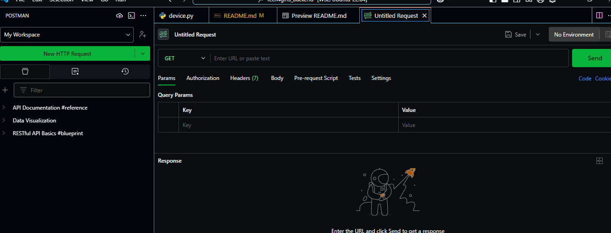
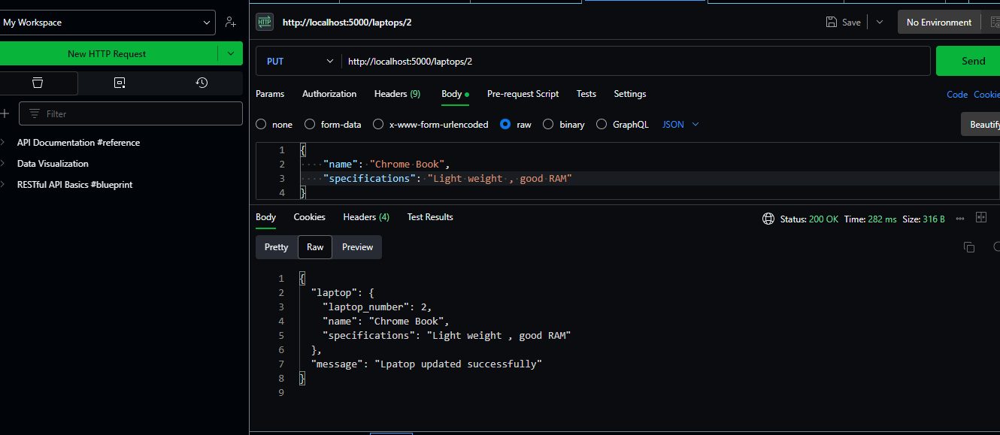
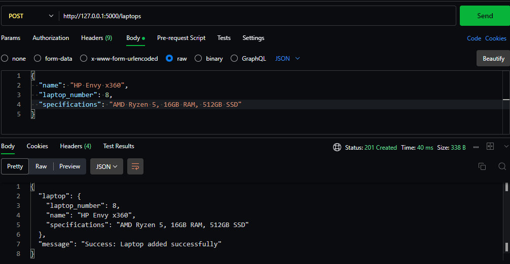

## Brief Description of API
This is simply a way or a set of rules for creating communication between interfaces such as  front-end, backend and databses.It acts as an intermediary to request and receive a response between a backend and the database. This can be achieved through creating endpoints. Enpoint is a single entry point in a single
api that performs a particular response.We also can also test the endpoints using Postman.

## Methods In API Used for Communicatopn
#### GET
- This method retrieves data from the database server

#### POST
- Used to insert data into the server

#### PUT
- Used to update the entire data that exists in the serever

#### PATCH 
- This is used to make a specific update to a body

#### DELETE
- Used to delete data from the server 

#### POSTMAN INTERFACE




## How To Test API endpoints With the GET method
1. Make the Postman extension is installed
2. Start the server by running the main file(app.py)
3. Go to the Postman tab and create a new HTTP request 
4. Utilise an endpoint by specifying the url of of any method you want to use. 
eg: http://localhost:5000/blueprint_name
5. Select the method ie: GET
6. Send the request

#### Output Using GET Method
```json
{
  "Successfully retrieved all laptops:": [
    {
      "laptop_number": 1, 
      "name": "Acer Aspire", 
      "specifications": "Intel H610 Core i5-12400 Processor."
    }, 
    {
      "laptop_number": 2, 
      "name": "DELL PRO", 
      "specifications": "SSD RAM ANF HDD"
    }, 
    {
      "laptop_number": 4, 
      "name": "Lenovo IdeaPad Duet 5 OLED Chromebook", 
      "specifications": "Size 13.3 Processor:2.55 GHz Snapdragon ."
    }, 
    {
      "laptop_number": 5, 
      "name": "Samsung Galaxy Book4", 
      "specifications": "ntel® Core™ 7 Processor 150U"
    }, 
    {
      "laptop_number": 6, 
      "name": "Hewlett Packard", 
      "specifications": "Intel Core i3 and i5"
    }
  ]
}
```
## How To Test Endpoint Using PUT/PATCH
1. Make sure the server is running
2. In Postman, select POST/PATCH 
3. Paste the url plus the name of the blueprint plus the name/id of what you want to update
eg:  http://localhost:5000/blueprint_name/id_or_name
4. Select Body and then select raw
5. From the pop up text that comes at the right side , select JSON
6. Enter the update using the json style
7. Send the request

#### Input and Output Using PUT or PATCH



### How To Test Using POST
1. Ensure the server runs
2. Create a new HTTP request
3. Select POST method
4. Input the url plus the name of the blueprint eg: http://localhost:5000/blueprint_name
5. Enter the data you want to input in a form of a json in the Body 
6. Send the request

### Input and Output Using POST



