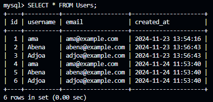
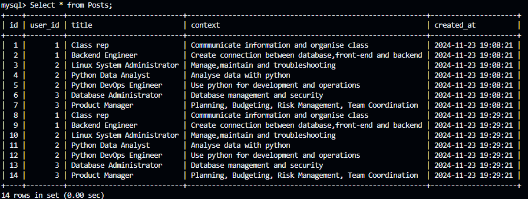
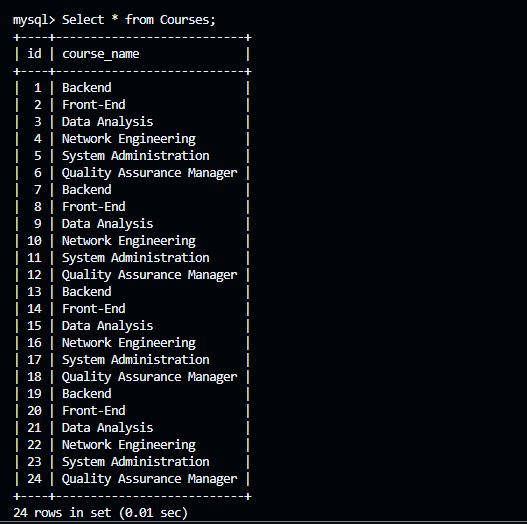
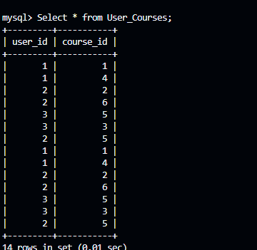

# Using SQL For Databases


Database is a structured collection of data that a backend server uses to store and manage information
effeciently.
Sturctured Query Language is a programming language used in relational database management for storing
and processing information in a database

## Authors
* [Nana Afua Antwiwaa Conduah](https://github.com/Antwi-tech)

## Project Overview
1. How to create a database
2. How to create a table
3. Demonstrate one to many relationship
4. Demonstrate many to many relationahip

## How To Create A Database and a Table

```sql  
 -- Use CREATE DATABASE TO CREATE A DAABASE AND IF NOT EXISTS TO ensure that the database is created once
   CREATE DATABSE IF NOT EXISTS database_name;

--  This tells sql waht database you want to work with.This is a very neccessary step.
   USE database_name;

 -- Create a table using the same procedure as a databse
   CREATE TABLE IF NOT EXISTS table_name(  
 --  This where you specify what columns you want your table to have
       id INT PRIMARY KEY,
       user_name VARCHAR(50) NOT NULL
   );

-- This is used to view what databases and tables you have created

    SHOW DATABASES;
    SHOW TABLES;

```



## Demonstration of One to many Relationship

One to one relationship simply means at exactly one row/record in a table can have many record in another table.The linkage is done by using a primary key from the Users table as a foreign key in the Posts table.
In this way, a user can have may posts.
It is seen in the picture below that user_id which references the id in the Users table can have multiple posts ie: user_id 1 is both a course rep and a backend engineer 



## Demonstration of Many to Many Relationship
This is where multiple entities in a record of a table can be matched to multiple records in another table. This is seen by the relationship between the Users table and the Courses table forming in the
Users_Courses table. To avoid redundancy, user_id and course_id become composite keys in Users_Courses table making sure that every user cannot be asigned to a course more than once. This removes duplication.

As seen in the user_courses table, a user can offer many courses and a courses can be taken by many users.
User with id 1 (ama), offers both Backend and Networking Engineering. Networking Engineering can also be offered by any other user too.







